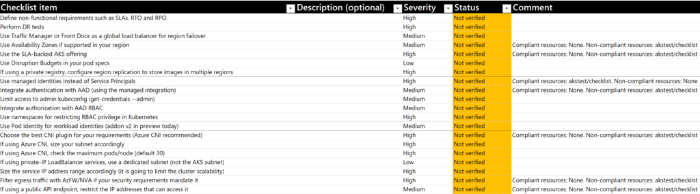

# はじめに
## 1.クラウドガバナンスとランディングゾーン
IT 運用モデルの一貫した要素は"ビジネス戦略との整合性、人材の編成、変更管理 (または導入プロセス)、運用管理、ガバナンス/コンプライアンス、セキュリティ" です。 それぞれの要素は、長期的なテクノロジ運用に不可欠です。
人材編成では、スピード感を持ってイノベーションを実現する『クラウド導入チーム』と、クラウド利用にあたって適切にコントロールを行う『クラウドガバナンスチーム』 が必須となります。
複数のワークロードに対して企業としての一貫したポリシーを適用し、集中したコントロールを行うために整備するものが、ランディングゾーンです。
ランディングゾーンについての基本的な考え方については、下記ドキュメントを参照してください。 
[https://docs.microsoft.com/ja-jp/azure/cloud-adoption-framework/ready/landing-zone/](https://docs.microsoft.com/ja-jp/azure/cloud-adoption-framework/ready/landing-zone/)

下記のリポジトリに、Azure レビューチェックリストが公開されています。 
[https://github.com/Azure/review-checklists](https://github.com/Azure/review-checklists) 
これは、Microsoft Fast Track のメンバーなどが、Azure の設計内容がベストプラクティスに沿っているものかどうかチェックする際に確認する項目を取りまとめたもので、だれでも利用できます。
本稿で述べる内容は、Azure レビューチェックリストのうち、LZ ( Landing Zone ) チェックリストの下記エリアと対応しています。
ランディングゾーンの設計にあたり、十分網羅できているかどうかの確認に活用してください。

|Main Area|Sub Area|
|----|----|
|Network Topology and Connectivity ネットワーク トポロジと接続性|Hub and spoke ハブアンドスポーク|
|Network Topology and Connectivity ネットワーク トポロジと接続性|Internet インターネット|
|Security, Governance and Compliance セキュリティ、ガバナンス、コンプライアンス|Governance 統治|
|Security, Governance and Compliance セキュリティ、ガバナンス、コンプライアンス|Security 安全|

　
## 2.Azure チェックリストの使い方
1. 最新リリースの Excel スプレッドシートを PC にダウンロードします
2. ドロップダウンリストを使用して、レビューを行うテクノロジと言語を選択します
3. コントロールボタン「最新のチェックリストをインポート」をクリックします。確認メッセージを受け入れると、スプレッドシートは選択したテクノロジと言語の最新バージョンをロードします

4. （オプション）マクロを操作できないユーザーにスプレッドシートを配布する場合（たとえば、セキュリティ上の理由または Office for Mac を使用しているため）、スプレッドシートのバージョンを（ xlsm ではなく）xlsx 形式で保存します。 マクロを無効にすると、スプレッドシートがチェックリストの更新されたバージョンまたは JSON ベースの AzureResourceGraph クエリ結果をインポートする機能を失うことに注意してください。
5. 行ごとに移動し、[ステータス]フィールドを使用可能なオプションの1つに設定し、[コメント]フィールドにコメントを入力します（推奨事項が関連しない理由や、未 解決のアイテムを修正するユーザーなど）。
   1. レビューには多くの行があるため、エリアごとに進むか（最初に「ネットワーキング」、次に「セキュリティ」など）、優先度の高い要素から始めて、その後「中」に進むことをお勧めします。
   2. 推奨事項が明確でない場合は、より多くのコンテキスト情報を含む「詳細情報」リンクがあります。
   3. 重要：必ずしも設計をシートに合わせる必要はなく、状況に応じて妥協する場合もあるかもしれません。影響が明らかな場合は、特定の推奨事項から逸脱しても問題ありません（たとえば、操作を簡素化してセキュリティを犠牲にしたり、重要でないアプリケーションのコストを削減したりするなど）。
   4. レビューの進捗状況をグラフで表示するには、「ダッシュボード」ワークシートを確認してください

## コラム：レビューチェックリストスクリプトの利用
レビューチェックリストはスプレッドシート形式だけでなく、自動でチェックを行えるスクリプトも提供されています。 
[https://github.com/Azure/review-checklists/tree/main/scripts](https://github.com/Azure/review-checklists/tree/main/scripts) 
これを使用すると、実環境の情報を読み出し、推奨事項と作成済みリソースの対応状況を確認することができます。対応するリソースのうち、準拠・非準拠の ID もそれぞれ表示されます。

チェックリストに列挙された推奨事項と、実環境の橋渡し役としてとても便利です。
今後も継続して機能拡張・アップデートが行われる予定ですので、是非使用してみてください。