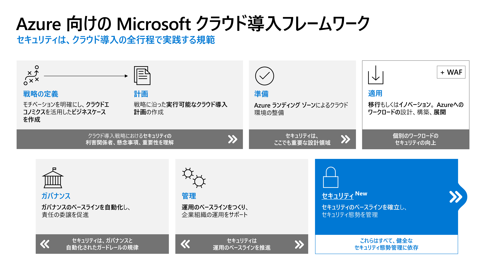
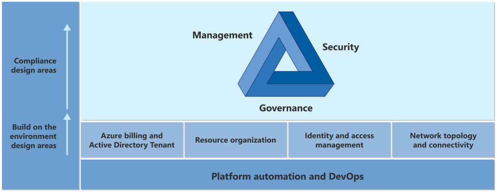
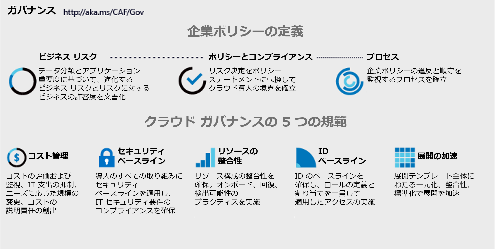
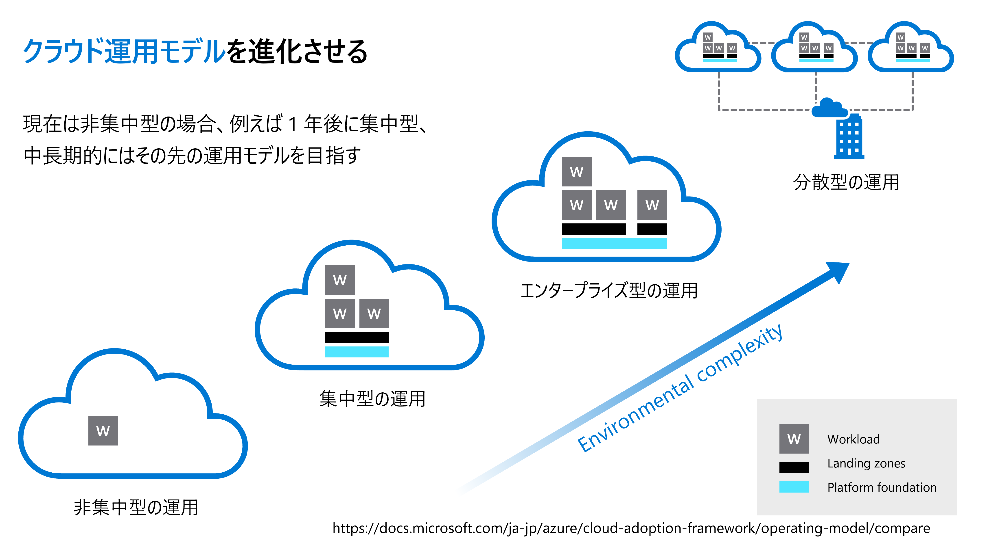

# 1章 ランディングゾーン
## 概要
戦略に沿ったクラウドを導入するにあたり、ガバナンスを強化することで、ビジネス機能に連携させて投資の価値を出すだけでなく、企業ポリシーを通じて明確なリスクにも対応し、適切なスコープを設定する必要があります。 
導入するクラウドのすべての取り組みに一元管理されたセキュリティベースラインを適用し、IT セキュリティ要件のコンプライアンスを確保することが、ガバナンスの強化に繋がります。
ランディングゾーンとは、ガバナンスの強化に適したセキュリティとガバナンスのベストプラクティスを維持しながらビジネスを推進する適切なクラウド環境を組織が運用するのに役立つ、柔軟にスケーリングすることが可能なアーキテクチャです。

## 1.クラウドサービスでのセキュリティフレームワークについて
### 1.1.クラウド移行とともに継続的に必要なガバナンス対応
世界中のほとんどの組織は、既存の IT 環境に適用される規則と運用モデルが原因で、クラウドのイノベーションと導入を行うスピードの低下を経験しています。 
既に組織では、IT 環境で確実にビジネスのニーズに絶えず対応できるように、独自の一連のプロセス、ツール、専用スタッフを用意していますが、これらの独自の仕組みがあることで、クラウドヘ移行するためには必ずしもシステム全体を丸ごと刷新することはできず、既存から一部の機能を引き継ぐことや、オンプレミスと共存する必要がある場合も同様に仕組みを刷新する対応が必要となってきます。 
このような問題を解決するためにベースとなるフレームワークを活用することができます。

 

### 1.2.クラウド環境構築から変化に対応しながら継続運用する方法
移行後も運用を継続する際にガバナンスはビジネスの状況に応じて変化を通じ改善を繰り返します。それに伴い、ランディングゾーンの内部で設計されているワークロードも変化に対応する必要があります。

Azure ランディングゾーンは、クラウドでのニーズに特化した最適な技術運用に合わせてクラウド環境を構築するのに役立ちます。特定の種類の構造またはクラウドの運用モデルがサポートされるように、各ランディングゾーンの実装がカスタマイズしています。
Azure ランディングゾーンで提供されているクラウド環境を作成するために必要なアーキテクチャ、実装方式、デプロイコードのサンプルを使用することで、すべてのクラウド環境導入作業をサポートされるといったメリットがあります。
以下のようなクラウド環境を利用するために必要な事項がすべてランディングゾーンの設計領域に内包されています。

- ガバナンス
- セキュリティ
- 運用管理
- 適切な課金設定
- アクセスマネジメント
- ネットワーク設計
- リソースの配置
- プラットフォームの自動化と DevOps

詳細については以下をご参照ください。 
<https://docs.microsoft.com/ja-jp/azure/cloud-adoption-framework/ready/landing-zone/design-areas>

 

## 2. ガバナンス強化に対する課題
企業として、クラウドを利用する上で適切なセキュリティベースラインを確保し、明確にリスクを低減する必要があります。システムは変化し、追加削除も行われるため、常に対策内容・方法をアップデートし続けることが求められます。しかし、追加削除が行われるたびにセキュリティ対策のアップデートをすることは難しく、更改ごとにすべてのシステムのセキュリティ入れ替えをしているケースが多くあります。

 

## 3.ランディングゾーンのアーキテクチャで実現可能なセキュリティ対策
フレームワークに沿ってアーキテクチャを検討し、Azure ポリシーを利用し、一元管理することが可能となります。一元管理が可能となることで、IT 環境が変化する際も柔軟に対応することが可能です。Azure ポリシーは、柔軟に定義することが可能であり、セキュリティ設計を検討する際に、サーバごとで種類の異なる場合も、一元管理下で適用することが可能となります。
これらにより、今後サーバの台数が増減することにも柔軟に対応可能となります。
クラウドも運用モデルを進化させることで、小規模から中規模、もしくは中規模から大規模と変化が生じる際もスケーラブルに対応可能です。

実際にビジネスの状況に応じて、徐々にクラウドへ移行していく以下のようなケースでもクラウド環境を変化させる必要があります。
- 法規制・改定や業務領域の拡大のための多地域への対応として、GDPR のルールに従い国内外の個人情報を適切な管理をするために、オンプレミスからクラウドに移行し、複数のリージョンで個人情報を管理する
- 企業の財務方針により、基本費用を抑えるために DC を年3割ずつ減らしクラウドへ移行していくこと

企業では変化に沿って環境を対応させるのと同時に担当者が入れ替わることがあります。
そのような場合でも、ガバナンスやセキュリティを変化に対応させることが絶対条件となります。 
Azure ランディングゾーンでは「定義済みのランディングゾーンの環境」、「定義済みの Azure ポリシー」を利用することで、統一される必要のある環境を属人化されることなく変化に対応し続けることが可能となります。