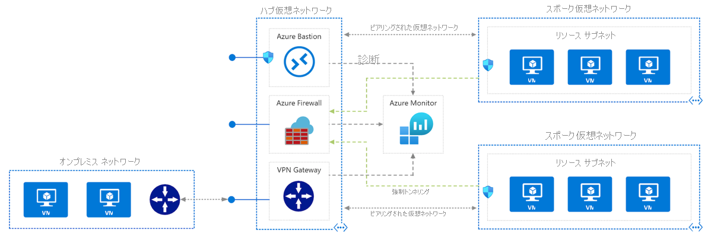

# 2章 ハブアンドスポークネットワークトポロジ
## 概要
ハブスポークネットワークトポロジは中心的なポイントとして機能するハブ仮想ネットワークと、ハブに接続される各スポーク仮想ネットワークで構成されています。ハブ仮想ネットワークとスポーク仮想ネットワークの間はピアリングによって接続されます。 
ハブ仮想ネットワークには、オンプレミス環境との接続や、Firewall などの共有コンポーネントが配置されており、各スポークネットワークから外部に接続する際にはハブ仮想ネットワークを経由します。スポーク仮想ネットワークには各システムのワークロードが配置されており、ほかのスポークとは分離して管理することができます。 
仮想ネットワーク間のピアリングにかかるコストは、全体の Azure 利用費用と比較すると軽微です。 
 
ハブアンドスポークネットワークトポロジについては、下記ドキュメントを参照してください。 
[https://docs.microsoft.com/ja-jp/azure/cloud-adoption-framework/ready/azure-best-practices/hub-spoke-network-topology](https://docs.microsoft.com/ja-jp/azure/cloud-adoption-framework/ready/azure-best-practices/hub-spoke-network-topology)

## 1.ハブアンドスポークの利用メリット
ハブスポーク型のネットワークを利用することにより、セキュリティや外部接続について一元管理できるようになります。
スポーク仮想ネットワークを新設する場合にも、ハブ仮想ネットワークにあるリソースを利用することで、共通のセキュリティポリシーを適用することができます。この構成をとることで、システムあたりのコストの軽減やワークロード追加が容易になるといったメリットを享受することができます。 
ハブアンドスポークネットワークトポロジでの Azure Firewall の活用については次の3章で紹介しています。 

| | ハブスポーク型 | 単独仮想ネットワーク構成 |
|----|----|---|
|セキュリティ |   すべての通信がハブ仮想ネットワークを経由するため、統一したセキュリティポリシーを適用することができる。  |  個別のシステムごとにセキュリティ要件を満たす設計が必要となり、手間がかかる。  |
|オンプレミスとの連携|   ハブ仮想ネットワークに設置した VPN / ExpressRoute ゲートウェイを利用することができる。 オンプレミスに対するアクセスコントロールも集中制御できる。|  個別のシステムごとにに検討が必要。複数の VPN / ExpressRoute が必要となる可能性があり、コストや準備期間がかかる。|
|コスト|   共通リソースを複数のワークロード間で共有することで、システム単位でのコストを軽減することができる。 |   仮想ネットワーク単位で必要なリソースをデプロイする必要がある。   |
|スケーラビリティ    |   新たにスポーク仮想ネットワークを設けることでワークロードを追加することができる。異なるサブスクリプションであってもかまわない。 |   大規模環境へのスケールが難しい。     |
