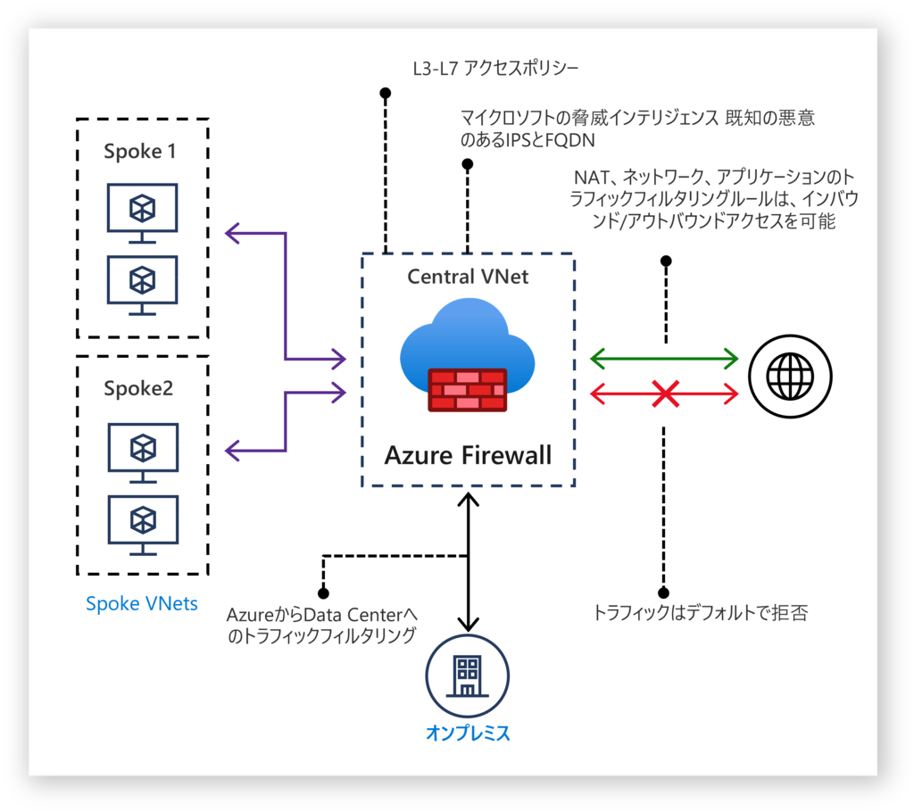
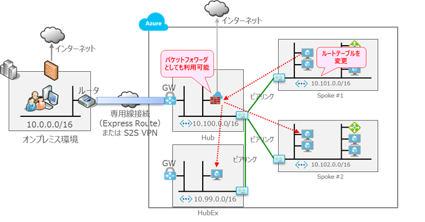
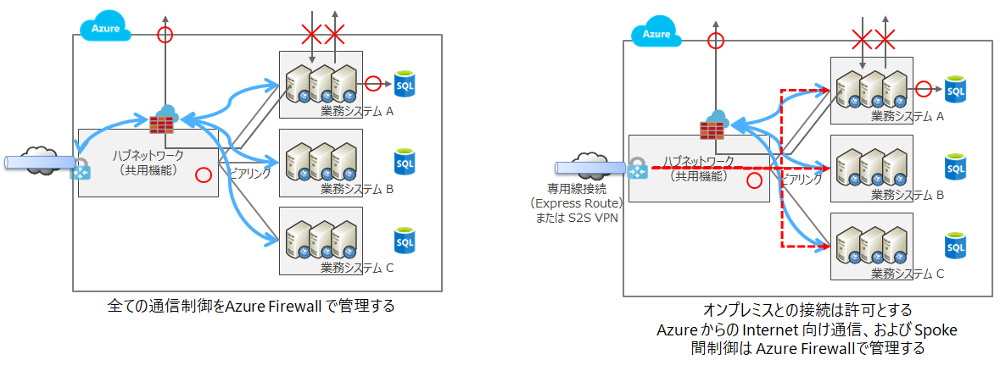
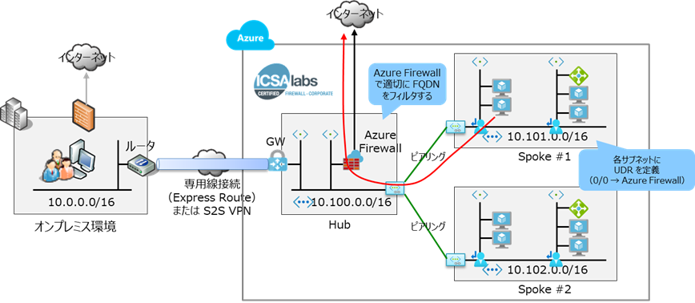
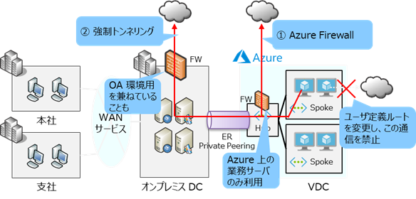
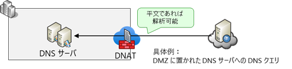
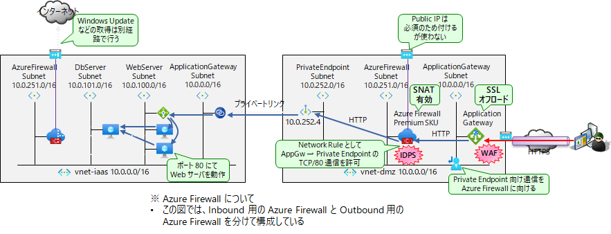

# 3章 Azure Firewall
## 概要
Azure Firewall は、クラウドネイティブのスケーラブルなファイアウォールです。

- すべてのトラフィックフローの中央管理

    送信トラフィックの FQDN による制御のほか、送信元と送信先の IP アドレス、ポート、プロトコルを基準として、"許可" または "拒否" のネットワーク フィルタリング規則を一元的に作成できます。Vnet とサブスクリプションを横断して共通のポリシーを適用することができます。 
    Azure Firewall は必要に応じて自動でスケールアウトするので、トラフィック量を考慮した設計が必要ありません。
- 完全な VNET 保護

    アウトバウンド、インバウンド、スポーク・スポークおよび、VPN や Express Route を含むハイブリッド接続トラフィックのフィルタリングが可能です。 
    脅威インテリジェンスに基づいたフィルタリングにより、既知の悪意のあるIPアドレスやドメインからのトラフィックを検知し、警告もしくは拒否することができます。 
- ログの管理

    ログをストレージアカウントにアーカイブしたり、イベントをイベントハブにストリーミングしたり、選択したログ分析やセキュリティ統合・イベント管理（ SIEM ）システムに送信することができます。 

 

AzureFirewall には Standard と Premium 2つの SKU が提供されています。 
Standard と Premium の間に処理能力の差はありません。Premium では Standard の機能に加え、以下の機能がサポートされます。
- IDPS (ネットワーク侵入検出と防止システム)
- TLS インスペクション
- Web カテゴリ
- URL フィルタリング
  
Azure Firewall の詳細については下記ドキュメントを参照してください。 
[https://docs.microsoft.com/ja-jp/azure/firewall/overview](https://docs.microsoft.com/ja-jp/azure/firewall/overview)

## 1.Azure Firewall の利用メリット
Azure Firewall では、ネットワークルールをポリシーとして定義し、適用することができます。 
新たに仮想ネットワークが追加された場合でも、接続を Azure Firewall 経由とすることで共通のネットワークポリシーを適用でき、簡単にセキュアなネットワーク追加ができるようになります。これによって、ワークロードの追加も安全かつ迅速に実現できるようになるので、新規サービスの提供などビジネスそのものにも良い影響が期待できます。 ネットワークトラフィックをフィルター処理するには、ネットワークセキュリティグループ( NSG )の利用も選択肢の一つですが、Azure Firewall を利用したほうが個別の設定の手間がかからず、一貫したポリシーが確実に適用できます。 
Azure Firewall は、99.95% の SLA が提供されます。デプロイ時に複数の可用性ゾーンにまたがるよう構成した場合の SLA は、99.99% です。オンプレミス環境のように機器の二重化などの可用性に関する考慮は不要で、すぐに使い始めることができます。

## 2.AzureFirewall の主な利用シナリオ
Azure Firewall の主な利用シナリオは下記の3つです。
いずれのシナリオでも、全体のネットワーク構成としてハブアンドスポークネットワークトポロジを採用し、ハブ仮想ネットワークに Azure Firewall を設置することで、スポーク仮想ネットワークに配したワークロードを一元的に保護することができます。 
ハブスポーク構成の概要については2章を参照してください。 

### 2.1.スポーク仮想間通信の制御とオンプレミス、クラウド間の制御
スポーク仮想ネットワーク間の通信を許可したい場合、ハブ仮想ネットワークに配置した Azure Firewall をパケットフォワーダとして利用することができます。Azure Firewall 上に許可された送信元／送信先のみパケットが転送されるので、大規模な環境でもネットワークの制御を一元管理することが可能です。また、スポーク仮想ネットワーク同士の接続がメッシュ構成になることも防げます。 
 
オンプレミス環境とスポーク仮想ネットワーク間の通信制御に Azure Firewall を使用する場合、以下の 2 通りの構成パターンがあります。
- オンプレミス <-> スポーク仮想間、すべての通信制御に Azure Firewall を用いる
- オンプレミス <-> スポーク仮想間は通信許可を前提として、Azure から Internet 向けの通信、および スポーク仮想間通信だけ Azure Firewall で制御する
  
 
オンプレミスからスポーク仮想ネットワークに配置されたリソースのプライベートエンドポイントの DNS 名にアクセスする場合、Azure Firewall を DNS フォワーダとして構成することも可能です。

### 2.2.アウトバウンド通信の制御 
Azure 仮想ネットワークからインターネットに向けた通信を制御することができます。各サブネットにユーザー定義ルート( UDR )を設定し、Azure Firewall で通信の許可・拒否を設定します。
Azure Firewall はネットワークルール( L4 )とアプリケーションルール( L7 )の2種類が設定可能です。また、FQDN タグも利用できるので、Microsoft サービスへの通信制御にも便利です。 
 
オンプレミス環境がある場合にはオンプレミス DC にある既存のファイアウォールを利用してインターネットに向けた通信をフィルタリングする構成も考えられますが、その場合でも以下の理由から Azure からのアウトバウンド通信の制御には Azure Firewall を使用する構成をお勧めします。
- オンプレミス DC を経由するために Express Route 帯域を消費せず、直接インターネットに通信を流せる
- OA 環境と業務サーバーの管理を分けることができる 

 

利用可能な FQDN タグについては、下記ドキュメントを参照してください。 
[https://docs.microsoft.com/ja-jp/azure/firewall/fqdn-tags](https://docs.microsoft.com/ja-jp/azure/firewall/fqdn-tags)

### 2.3.インバウンド IDPS
IDPS 機能を用いて不正侵入の検知・防御を行うことができます。危険な通信を検知した場合の対応として、無効/アラート(デフォルト)/アラートを出して拒否のいずれかを選択することができます。
- DMZ に入ってくる non-SSL 通信を IDPS で検査
    - DNS サーバなど、平文の通信であればそのまま解析が可能です。
    - DNAT に入ってくる攻撃が検知できます。
  
     
- インターネットに公開する Web サーバの場合
    - SSL で暗号化された通信はそのまま解析することができないため、Azure Firewall の前にApplication Gateway を配置し、SSL をオフロードした後に HTTP トラフィックを検査することで Web サーバの保護が可能になります。
  
     