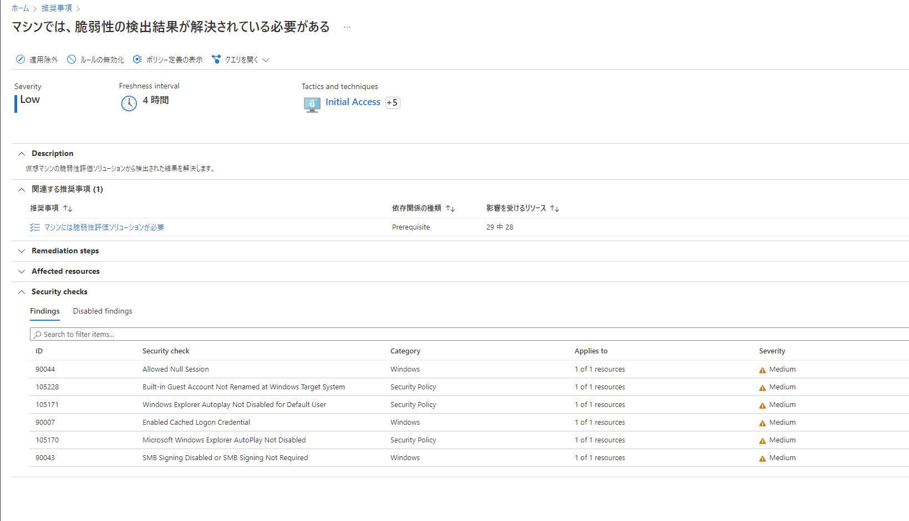
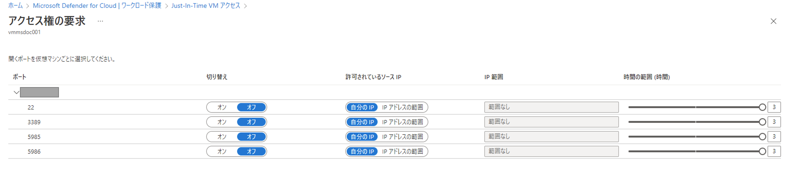
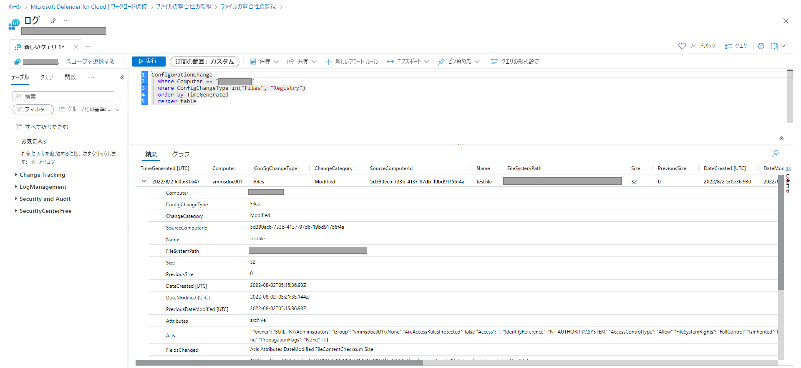
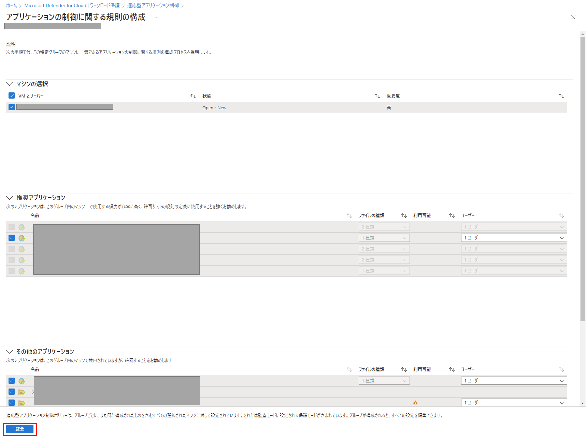

# 4章 Azure 内のサーバを保護する - Microsoft Defender for Servers
## 概要
Microsoft Defender for Servers は、Azure だけでなく、AWS 、GCP 、オンプレミスといった Azure 以外で実行されている Windows マシンと Linux マシンに脅威検出と高度な防御を追加することを可能とします。 
実際に第1章で紹介したランディングゾーンでクラウドを構成し、管理する上で本機能は有効です。自動オンボーディング機能により機能を有効化することで既存の VM や、新規に構築する VM に自動で導入することができ、一括管理が可能となります。

詳細についてはこちらの Microsoft 公式ドキュメントをご参照ください。 
<https://docs.microsoft.com/ja-jp/azure/defender-for-cloud/defender-for-servers-introduction>

 

## 1.Microsoft Defender for Servers 機能の利用メリット
現在、IaaS のワークロード保護のためにサードパーティのセキュリティ製品の導入をされている方も多いかと思いますが、Azure への移行により、再度導入をすること、定期的なスキャン、その他エージェントが必要である場合があります。 
Defender for Servers ではその他のエージェント導入や定期的なメンテナンスは不要で、機能を有効化することで対策を始めることができます。
これらの脅威と脆弱性の管理により、脅威の情勢、組織での検出、脆弱なデバイス上の機密情報、ビジネス事情に従って、脆弱性の優先順位が付けられ、対応が可能になります。 

### 1.1.EDR アラートの検知
サードパーティのセキュリティ製品の EDR 検知機能と同様に、マルウェア検知と感染後の適切な対策を行うことができる機能です。検知時には、アラートの担当者の割り当て・アラートのストーリーの確認まで可能であることで、検知から対応までをすべて管理することが可能です。

### 1.2.Qualys と連携した脆弱性スキャナー
Microsoft が最新の情報を提供しており、未知の脆弱性の対策を即時に行うことができます。脆弱性情報は、世界中で新規に判明した脆弱性情報が Microsoft の対応情報と紐づけが自動的に行われ、迅速な脆弱性への対応が可能になります。

### 1.3.Just-In-Time VM アクセス
悪意をもった攻撃者はブルートフォースアタックで管理ポートを主な対象として攻撃をしかけてきます。 運用時にリモートデスクトップなどでアクセスが必要となる場合に必要に応じて、管理ポートを、必要な時間、必要なコンピューターに対してのみアクセスを許可させることが可能となり、簡単かつ安全にアクセスすることができます。

### 1.4.ファイルの整合性監視
セキュリティで重視されているファイルやレジストリの改ざんの検知を行うために有効な機能です。

### 1.5.アダプティブアプリケーション制御（適応型アプリケーション制御）
実際に VM を構築し、運用していく際にはVMごとで役割を分けることから、導入するアプリケーション自体は少ないケースが多く、セキュリティの観点から管理外のアプリケーションをインストールされることを防ぐ対策を行います。アプリケーションをホワイトリスト管理する本機能を利用することで実現可能です。

 

## 2.IaaS のワークロードへの脅威と脆弱性の管理のオンボード
Microsoft Defender for Servers は、対象のサブスクリプションすべて既存と今後の新規のマシンを保護することができます。 
ビジネスの状況に応じでスケーリングが必要となった場合も意識することなく、ワークロードの保護を継続することができます。保護の開始についてはバックグランドで行われるため、エンドポイントレベルでの変更は必要ありません。

 

### Microsoft Defender for Server を有効にする
Microsoft Defender for Servers は Azure 上で稼働しているサービスであるため、従来のアプライアンス製品のようにマネージャサーバを構築する必要や、ワークロードごとにエージェントを導入する必要もありません。サブスクリプション配下のすべてのマシンの保護ができます。

 

#### Azure ポータルでの「サブスクリプション レベル」での設定手順
1. Microsoft Defender for Cloud [ 環境設定 ] から、[ サブスクリプション名 ] をクリックして設定画面を開く 

2. サーバー をオンにして保存をクリック

保護の開始・機能の詳細については以下をご参照ください。 
<https://docs.microsoft.com/ja-jp/azure/defender-for-cloud/integration-defender-for-endpoint?tabs=windows>

 

#### Microsoft Defender for Servers プランによる機能の違い
<table class="listtbl">
    <tr>
      <th>機能</th>
      <th>P1</th>
      <th>P2</th>
    </tr>
    <tr>
      <td>Azure 、AWS 、GCP のリソースの自動オンボード</td>
      <td align="center">〇</td>
      <td align="center">〇</td>
    </tr>
    <tr>
      <td>Microsoft の脅威と脆弱性の管理</td>
      <td align="center">〇</td>
      <td align="center">〇</td>
    </tr>
    <tr>
      <td>Microsoft Defender for Cloud または Microsoft 365 Defender ポータルを使用できる柔軟性</td>
      <td align="center">〇</td>
      <td align="center">〇</td>
    </tr>
    <tr>
      <td>Microsoft Defender for Cloud と Microsoft Defender for Endpoint の統合 (アラート、ソフトウェア インベントリ、脆弱性評価) </td>
      <td align="center">〇</td>
      <td align="center">〇</td>
    </tr>
    <tr>
      <td>セキュリティ ポリシーと規制コンプライアンス</td>
      <td align="center">-</td>
      <td align="center">〇</td>
    </tr>
    <tr>
      <td>ログ分析 ( 500 MB 無料)</td>
      <td align="center">-</td>
      <td align="center">〇</td>
    </tr>
    <tr>
      <td>Qualys を使用した脆弱性評価</td>
      <td align="center">-</td>
      <td align="center">〇</td>
    </tr>
    <tr>
      <td>脅威の検出: OS レベル、ネットワーク レイヤー、コントロールプレーン</td>
      <td align="center">-</td>
      <td align="center">〇</td>
    </tr>
    <tr>
      <td>アダプティブアプリケーション制御</td>
      <td align="center">-</td>
      <td align="center">〇</td>
    </tr>
    <tr>
      <td>ファイルの整合性の監視</td>
      <td align="center">-</td>
      <td align="center">〇</td>
    </tr>
    <tr>
      <td>Just-In-Time VM アクセス</td>
      <td align="center">-</td>
      <td align="center">〇</td>
    </tr>
    <tr>
      <td>アダプティブ ネットワークのセキュリティ強化機能</td>
      <td align="center">-</td>
      <td align="center">〇</td>
    </tr>
 </table>

 

## 3.EDR アラートの検知
Azure Portal 上から、Microsoft Defender for Servers を有効にすることで、EDR の機能も有効となり、Microsoft Defender for Endpoint で検出されます。 
また、Microsoft Defender for Endpoint が適用されたサーバで EDR の検知テストを実行し、操作を実感することができます。 
検知テスト手順：<https://docs.microsoft.com/ja-jp/microsoft-365/security/defender-endpoint/run-detection-test?view=o365-worldwide>
 

実際に検知されたものは[Microsoft 365 Defender](https://security.microsoft.com) 上の画面の [ アラート ] で確認することができます。 
確認したアラートを選択すると、実際にどのようなストーリで検知されたか。また、その対処方法についてを画面上で確認することができます。

 

## 4.機能の紹介
### 4.1.Qualys と連携した脆弱性スキャナー
Defender for Servers には、マシンの脆弱性を検出し、管理するための選りすぐりのツールが含まれます。 マシンにデプロイするツールを選択できます。 検出された脆弱性は、セキュリティの推奨事項に示されます。
以下のセキュリティに関する推奨事項ページでは「対象とする VM 」、「対応すべき事項」を確認することができます。

#### 導入手順
1. Microsoft Defender for Cloud の [ 推奨事項 ] から、[ マシンには脆弱性評価ソリューションが必要 ] をクリックして設定画面を開きます。

2. Unhealthy resources の中から、導入予定の VM を選択し、[ Fix ] をクリック

#### スキャン結果の確認
Microsoft Defender for Cloud の [ 推奨事項 ] から、[ マシンでは、脆弱性の検出結果が解決されている必要がある ] をクリックして詳細画面を開きます。 
以下のような画面が表示され、<strong>脆弱性の対処が必要なマシン、対処・修復について</strong>が一目で確認することが可能となります。

 

### 4.2.Just-In-Time VM アクセス
#### Just-In-Time VM アクセス有効化
1. Microsoft Defender for Cloud の [ ワークロード保護 ] から、[ Just-In-Time VM アクセス ] をクリックして設定画面を開きます。

2. [ 構成されていません ] タブをクリックし、任意の仮想マシンを選択します。

3. [ (任意の台数)台の VM で JIT を有効にする ]　をクリックします。

#### Just-In-Time VM アクセス権の要求
1. Microsoft Defender for Cloud の [ ワークロード保護 ] から、[ Just-In-Time VM アクセス ] をクリックして設定画面を開きます。

2. [ 構成済み ] の任意の仮想マシンを選択し、[ アクセス権の要求 ] をクリックします。

3. アクセスに必要なポート、許可するソースIP、アクセスする時間を選択し、[ ポートを開く ] をクリックします。

 

### 4.3.ファイルの整合性監視
ファイルの整合性監視を有効化することで、オペレーティング システム ファイル、Windows レジストリ、アプリケーションソフトウェア、Linux システム ファイルなどを監視し、ファイル変更を確認することで、攻撃の兆候を判別することができます。本機能はワークスペースごとに有効化します。

#### ファイルの整合性監視の有効化
1. Microsoft Defender for Cloud の [ ワークロード保護 ] から、[ ファイルの整合性監視 ] をクリックして設定画面を開きます。

2. 任意のワークスペースを選択します。　※[ UPGRADE PLAN ] と記載のあるワークスペースは有効となっていないものとなり、未記載、および [ ENABLE ] となっているワークスペースは有効となっています。

3. [ ファイルの整合性監視を試す ] をクリックします。

#### 変更があったファイルの確認
1. Microsoft Defender for Cloud の [ ワークロード保護 ] から、[ ファイルの整合性監視 ] をクリックして設定画面を開き、ファイルの整合性監視を有効化したワークスペースを選択します。

2. 変更があった VM 、変更の件数が表示されていることが確認できます。変更があった VM をクリックします。

3. 変更があったファイルの詳細について、どの VM でどのような変更があったかを確認することができます。

 

### 4.4.アダプティブアプリケーション制御（適応型アプリケーション制御）
アダプティブアプリケーション制御は、VM にインストールされているアプリケーション、また、これからインストールするアプリケーションに対して、アプリケーションのホワイトリストをもとに集中管理することができるサービスです。 
本機能で安全なアプリケーションと定義したもの以外のアプリケーションが実行された際に、セキュリティアラートとして表示されることで、悪意をもった攻撃として実行されたか、安全かを判別することが可能です。

#### アダプティブアプリケーション制御の開始方法
1. Microsoft Defender for Cloud の [ ワークロード保護 ] から、[ 適応型アプリケーション制御 ]　をクリックして設定画面を開きます。

2. [ 推奨 ] タブを選択し、任意のワークグループを選択します。※推奨タブに表示するためには以下の条件があります。
- Log Analytics エージェントがインストールされていること
- なんらかのアプリケーションをインストールし、そのイベントが Log Analytics エージェントで送信されていること

3. [ 対象の VM ] 、[ 対象の推奨アプリケーション ]、[ その他のアプリケーション ] を選択し、[ 監査 ] をクリックします。

詳細については以下をご参照ください。 
<https://docs.microsoft.com/ja-jp/azure/defender-for-cloud/adaptive-application-controls>

 

### 4.5.アダプティブネットワークのセキュリティ強化
アダプティブネットワークのセキュリティ強化は、NSG を適用してリソースとの間でやり取りされるトラフィックをフィルター処理することにより、ネットワークセキュリティを強化することができます。
仮想マシンの過去のトラフィック分析を行い、NSG 内の既存のルールの制限が緩いことや、範囲が広すぎるなどの理由で、潜在的な攻撃面の増加に繋がるルールを判断し、推奨されるルールを表示します。

#### アダプティブネットワークのセキュリティ強化 設定画面の確認
1. Microsoft Defender for Cloud の [ ワークロード保護 ] から、[ アダプティブ ネットワーク強化 ]　をクリックして設定画面を開きます。 
この画面には Microsoft Defender for Cloud の[ 推奨事項 ] から [アダプティブ ネットワーク強化の推奨事項をインターネット接続仮想マシンに適用する必要がある] 選択することでアクセスすることも可能です。

2. [ Unhealty resources ] に項目が存在する場合、推奨のルールがあります。これを解決することで、[ Healty resources ] に移動し、セキュリティ強化できたことを確認可能となります。

ルールの適用については以下をご参照ください。 
<https://docs.microsoft.com/ja-jp/azure/defender-for-cloud/adaptive-network-hardening>
